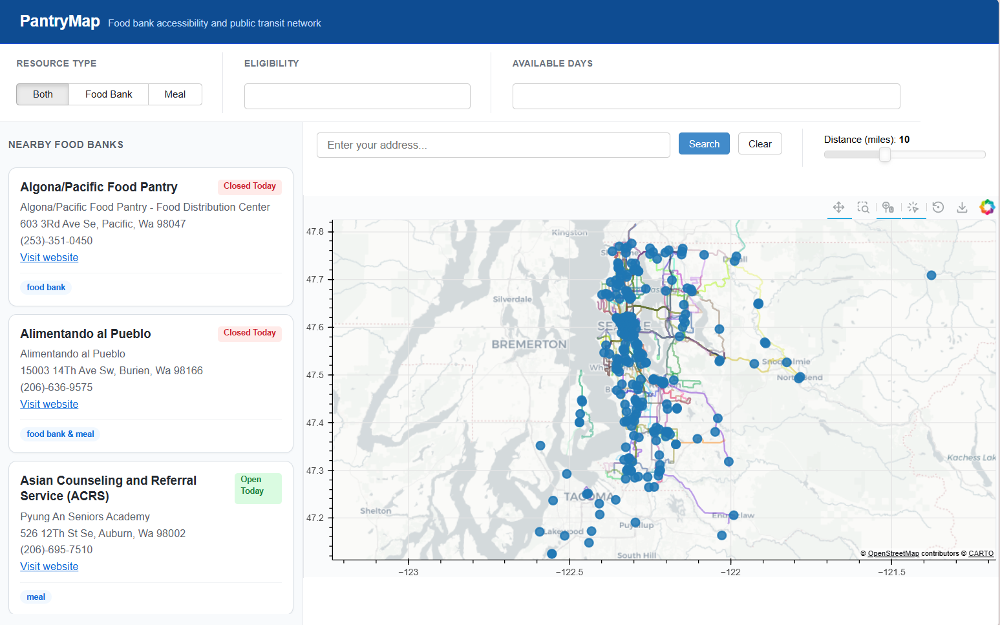
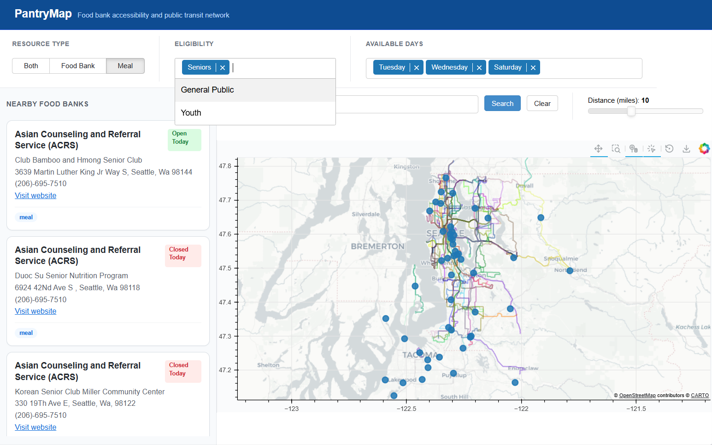
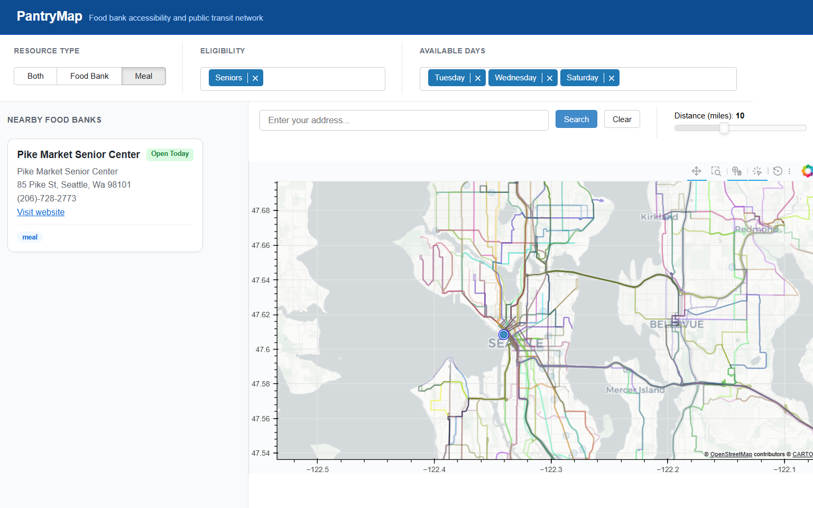
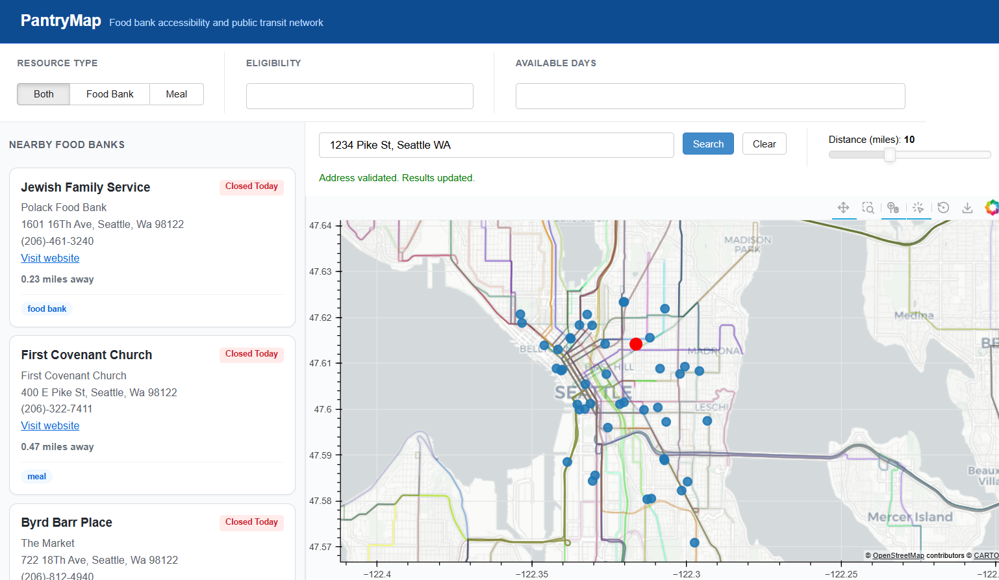
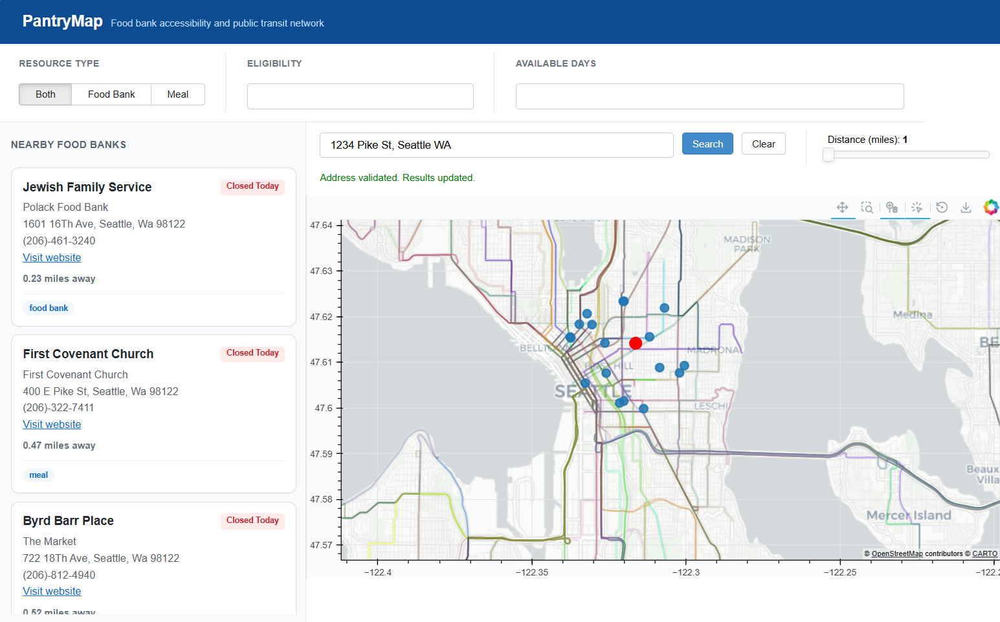
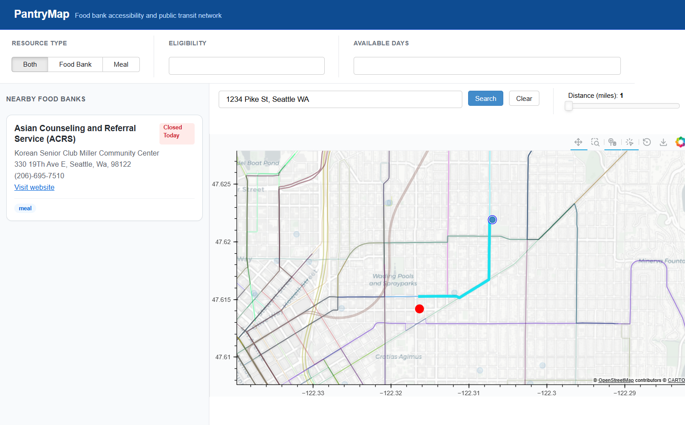

# Examples

This document demonstrates how to use **PantryMap** to locate nearby food banks and meal services. The examples below walk through common tasks a user might perform when interacting with the application.

Each example provides step-by-step instructions along with screenshots illustrating the interface.

## Examples in this Guide

1. Browsing and filtering food banks
2. Finding food banks near an address

---

## Example 1: Browsing and Filtering Food Banks

---

## Step 1: Open the PantryMap Application

When you open PantryMap, an interactive map will appear displaying food banks and meal programs across the Seattle area.

Each location is represented by a marker on the map. At this stage, all available locations are visible.

**Figure 1: Initial map view showing all locations**

---

## Step 2: Apply Filters

You can narrow the displayed results using the filter options.

The available filters include:

* **Type of service** – Food bank, meal program, or both
* **Eligibility** – Seniors, youth, or general public
* **Available days** – Days of the week when the location is operational

Select one or more filter options based on your needs.

Once filters are applied, the map will automatically update to show only locations that match the selected criteria.

**Figure 2: Map after applying filters**

---

## Step 3: Select a Location

Click on a marker on the map to learn more about that location.

A panel will appear displaying additional details, including:

* Location name
* Address
* Hours of operation
* Type of services provided
* Eligibility information

This allows you to quickly determine whether the location meets your needs.

**Figure 3: Location details displayed**

---

## Example 2: Finding Food Banks Near an Address

---

## Step 1: Enter Your Address

Locate the search bar and type in an address.

Example:

`1234 Pike St, Seattle WA`

Once you submit the address:

* A **red marker** appears on the map showing the entered location.
* The map will display nearby food banks and meal programs within the current distance range.

**Figure 4: User address highlighted on the map**

---

## Step 2: Adjust the Distance Range

PantryMap includes a **distance slider** that controls how far from your location the search should extend.

By default, the distance is set to **10 miles**.

You can adjust the slider to expand or reduce the search area. As you move the slider, the map updates to display all food banks and meal programs within the selected range.

**Figure 5: Adjusting the distance slider**

---

## Step 3: Select a Food Bank

Click on a food bank marker within the search range.

Once selected:

* The map highlights **only your location and the selected food bank**.
* The **best public transit route** between the two locations is displayed on the map.
* The sidebar updates to show detailed information about the selected location.

Information shown includes:

* Address
* Service type
* Hours of operation
* Eligibility requirements

**Figure 6: Transit route and location details**

---

## Summary

Using PantryMap, you can:

* Browse all available food banks and meal programs
* Apply filters to find services that meet your needs
* Search for locations near a specific address
* Adjust the search distance using a slider
* View detailed information and public transit routes to selected locations

These tools help users quickly locate accessible food resources in their area.
