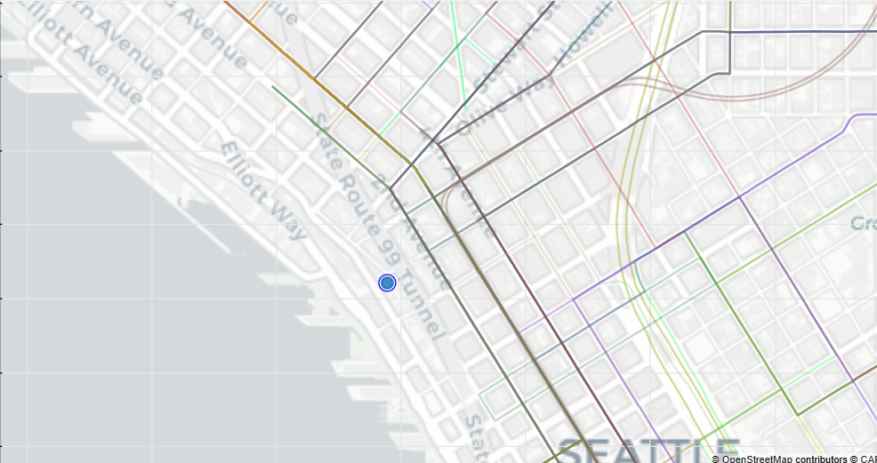

# Examples

This document demonstrates how users interact with **PantryMap**, a web application that helps users locate nearby food banks and meal services in Seattle.

The examples below walk through common user workflows and show how the system responds to user actions. Screenshots illustrate the interface at each step.

---

# Example 1: Browsing Food Banks and Applying Filters

## Objective

The user wants to browse operational food banks and meal services and filter the results based on their needs.

---

## Step 1: Open the Application

The user opens the PantryMap web application.

**System behavior**

* An interactive map loads.
* All currently operational food banks and meal programs are displayed as markers on the map.

**Figure 1: Initial map showing all food bank and meal locations**

---

## Step 2: Apply Filters

The user applies filters to narrow the results. Available filters include:

* **Type of service** (food bank or meal program)
* **Operating hours**
* **Service requirements**

**System behavior**

* The map automatically updates.
* Only locations matching the selected filters remain visible.

**Figure 2: Map after filters are applied**

---

## Step 3: Select a Location

The user clicks on a location marker on the map.

**System behavior**

A detail panel appears containing:

* Location name
* Address
* Hours of operation
* Type of services offered

**Figure 3: Location details displayed**

---

## Step 4: View Public Transportation Routes

After selecting a location, the system displays available public transportation routes.

**System behavior**

* Nearby transit routes are shown on the map.
* The user can visually see how to reach the location using public transportation.

**Figure 4: Transit routes to selected location**

---

# Example 2: Finding the Closest Food Banks

## Objective

The user wants to find the food banks and meal services closest to their current location.

---

## Step 1: Enter a Location

The user enters an address into the search bar.

Example input:

`1234 Pike St, Seattle WA`

**System behavior**

* The map centers on the entered location.

**Figure 5: Map centered on user location**

---

## Step 2: Display Closest Locations

The system identifies the closest food banks and meal services.

**System behavior**

* The **five closest locations** are highlighted on the map.
* A list of these locations appears beside the map.

Each result includes:

* Location name
* Address
* Distance from the user

**Figure 6: Closest locations highlighted**

---

## Step 3: Select a Location

The user selects one of the suggested locations from the list or clicks the marker on the map.

**System behavior**

Additional information about the location is displayed, including:

* Full address
* Hours of operation
* Type of service provided
* Public transportation routes to the location

**Figure 7: Detailed location information**

---

# Summary

These examples demonstrate two common ways users interact with PantryMap:

1. **Browsing and filtering food banks**
2. **Finding the closest food banks based on a user's location**

Both workflows allow users to quickly access essential information and transportation routes to nearby food resources.
